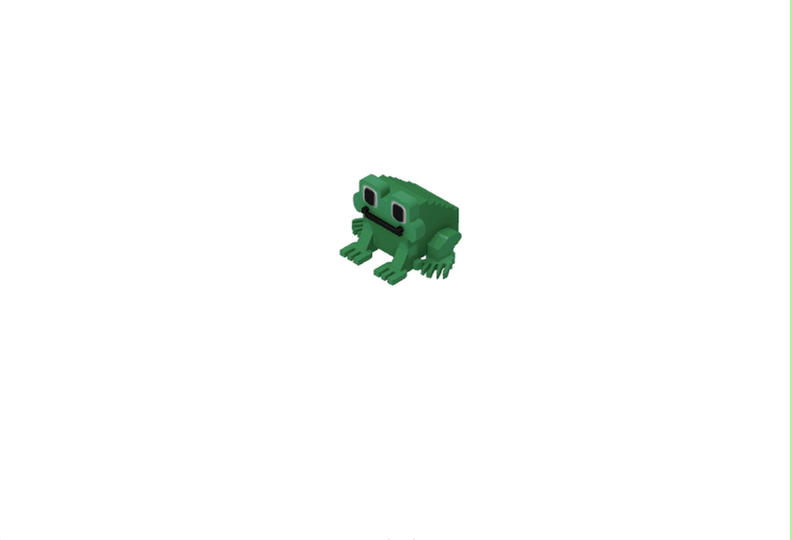

To make the game exciting, we need to handle the loss situation.

To make it easier to get started, we’ve prepared the agent prompt with technical details on how to manage game states, detect collisions, and reset the game.

So, what are the key points to focus on?

### Game Over condition
Let’s add a game over condition when an enemy touches our hero. This means we should check collisions between the player and enemies, and if a collision happens, we immediately switch the game into the "Game Over" state. This state should have higher priority than any other collision handling — once the hero is hit, nothing else should "override" that outcome. 

One important detail: make sure this collision check runs during gameplay, so enemies can trigger "Game Over" even if the player isn’t moving.

### Game Over state
When the player loses, the game should clearly show it and stop reacting like normal gameplay. Display a "Game Over" message at the scene so the player instantly understands what happened.

At the same time, the hero should disappear (either remove the player object or make it invisible), all enemies should stop moving, and any further player actions should be disabled (no movement, no attacks, no input), so the game should feel "frozen".

### Reset logic
A loss shouldn’t be the end — it should be an invitation to try again. Use the **Space** key to reset the game. When **Space** is pressed in the "Game Over" state, reset the player back to the starting position, clear all existing enemies and respawn them at the map corners, reset the score and update the UI, remove the "Game Over" message, and resume the game loop so everything feels ready for a new attempt.

### Putting it all together
Use the specification from the `spec.md` file to implement the "Game Over" flow. By the end of this task, when an enemy touches the hero you should see the game over message, the hero should disappear, enemies should stop moving, and pressing **Space** should reset the game and let you play again.

Try changing the code manually or ask Junie to better understand what customization options you have. You should get something like this:

