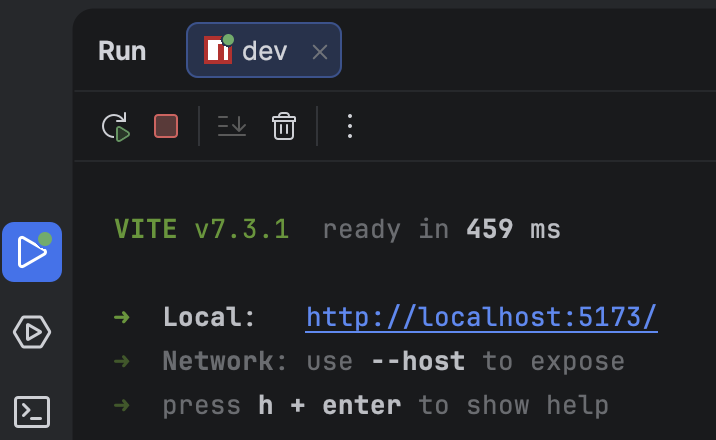

### What’s inside the project

You’ll build and edit everything right here in the IDE, starting from an empty project — a clean beginning where your game world can grow step by step. We’ll use [Three.js](https://threejs.org/) to create the 3D scene.

### Task specification
Every task includes a `spec.md` file — it’s a short document that describes everything we expect in this task. You can use it as a prompt as-is, or tweak it to fit your approach.

### Files to know
You’ll see `.junie/guidelines.md` — it contains general guides for the agent and things to keep in mind.

In `game/package.json` you’ll find the central place where the project’s setup, tooling, and required dependencies (libraries/modules) are managed. The most important part for us right now is `scripts`: this is where we define commands for the project, for example running the app, running tests, or installing dependencies in more complex projects.

We also won’t overload you with technical details. Each lesson is split into a task description (what to do right now) and optional extra materials like a Markdown cheat sheet (when you want support).

### Let’s run your project for the first time!
To run the game, open `game/package.json` and click  next to the `dev` script in the IDE interface.

  

Alternatively, you can run it from the terminal by navigating to the <code>game</code> folder with <code>cd game</code> command, and then starting it with <code>npm run dev</code>.

You should see an output similar to this:

  

Then open the page in your browser — you’ll see a blank stub for now. But soon, that empty world will become Tode’s battlefield!

### Stopping the project
Remember to always stop your application when you're done. Click the  button in the tool window at the bottom of your IDE or press `^C` (Ctrl+C).

**Time to begin our adventure!**

