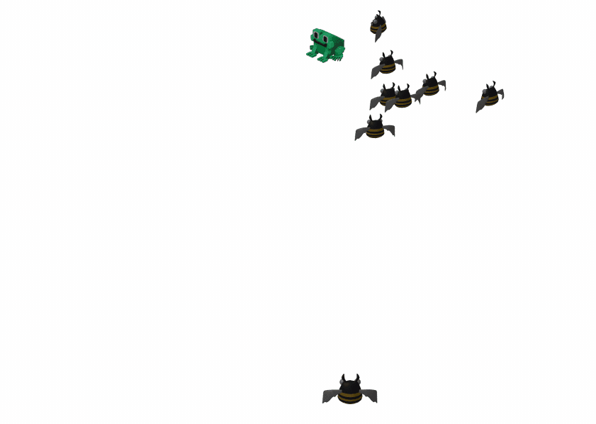

* Enemy objects: using provided model with animation
* Automatic spawn in the scene corners
* Moving towards the player
* Check collisions (will be in next tasks)
- Enemy models may load rotated, so you might need to manually fix their base orientation after loading (similar to the player model)

At this stage, enemies can overlap each other and do not inflict any damage on our hero. This is normal, and we will add handling for these cases in the future.

Try changing the code manually or ask Junie to better understand what customization options you have. You should get something like this:

Adjust enemies speed, spawning delay and rotation if needed.

Use the provided model or find another one.
> `enemy.glb` — Armabee Evolved by Quaternius [Public Domain](https://creativecommons.org/publicdomain/zero/1.0/) via [Poly Pizza](https://poly.pizza/m/GcttdvsqsQ).
  

