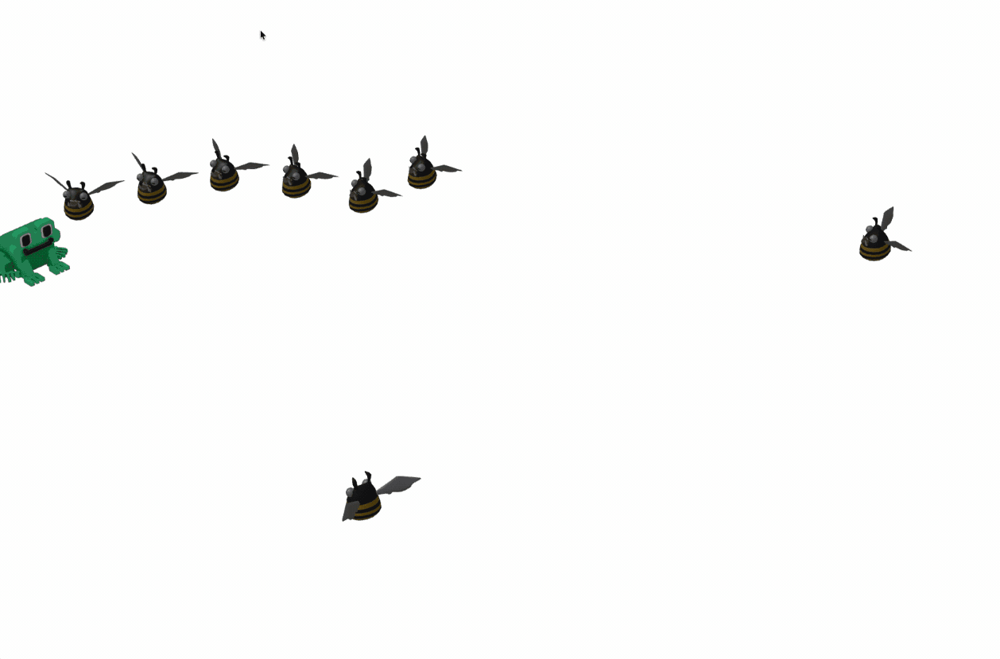

* Use bounding box collision detection algorithm as the simplest solution
* Enemies should not collide with themselves
* Enemies should not collide with player

Try to adjust the collision distance change the code manually or ask Junie to better understand what customization options you have.

You should get something like this:

