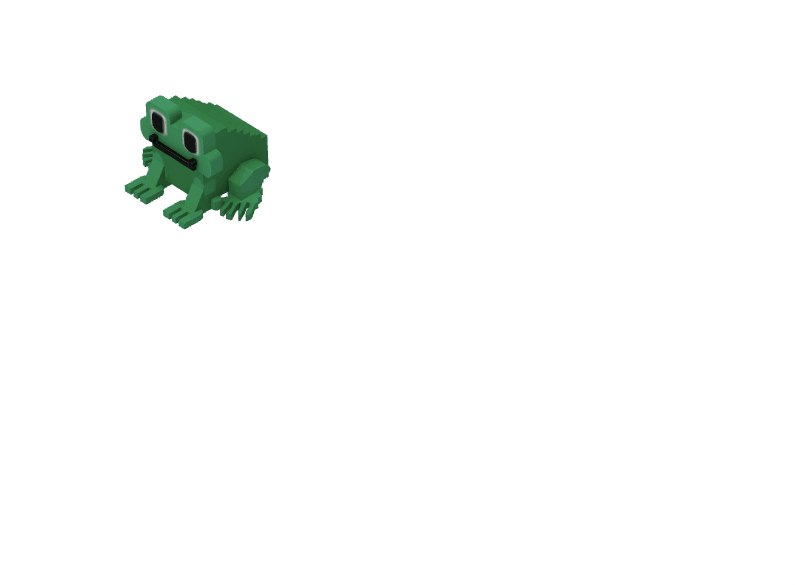

Now that we have our scene set up and our hero in place, it's time to bring them to life! 
In this task, we will implement keyboard-controlled movement with a simple jumping animation.

To help you out, we've prepared the agent prompt with some technical things for the movement logic.

So, what should we focus on?

### Input collection
To make our player move, we need to listen for the user input. Let our hero move using the arrow keys on the keyboard.
Since several keys might be pressed in quick succession, it's a good practice to save them to a queue. 
This ensures that every move is processed in the order it was received, making the controls feel responsive and intentional.

### Movement logic & jump animation
A simple "teleport" from one point to another doesn't look very natural. 
To make the movement feel like a hop, we’ll use a bit of math:
- Progress Tracking: Each move will have a progress value from 0 to 1.
- The "Jump" Effect: We can use `Math.sin(progress * Math.PI)` to calculate the height (Z-axis). This creates a parabolic arc, making the player lift off the ground and land smoothly.
- Rotation: We should remember to rotate the player model toward the direction they are moving!

### The animation loop
The heart of any game is the **animation loop**. It is responsible for creating the illusion of motion.
Because 3D objects don't move "on their own," you need a central place to recalculate their positions, 
rotations, or animations many times per second. 

Usually the frequency of calling this function is synced with your monitor's refresh rate to ensure smooth, tear-free visuals (e.g. 60 times per second).

So inside Three.js's animation loop, we will:
1. Check if the player is currently moving.
2. If not, pull the next instruction from our input queue.
3. Update the movement progress and apply the calculated position and rotation to the player group.
4. Tell the renderer to draw the updated scene.

### Putting it all together
Use the specification from the `spec.md` file to implement the movement system. It will update your `Player.js` component and the main animation loop in `main.js`.

By the end of this task, you should be able to move your character around the screen using the arrow keys:

### Customize it your way
Speed and jump distance are key to how the game feels. 
If the jump is too slow, the game feels sluggish; if it's too fast, it becomes hard to control. 
Try to find the right balance between jump speed, height, and distance.
