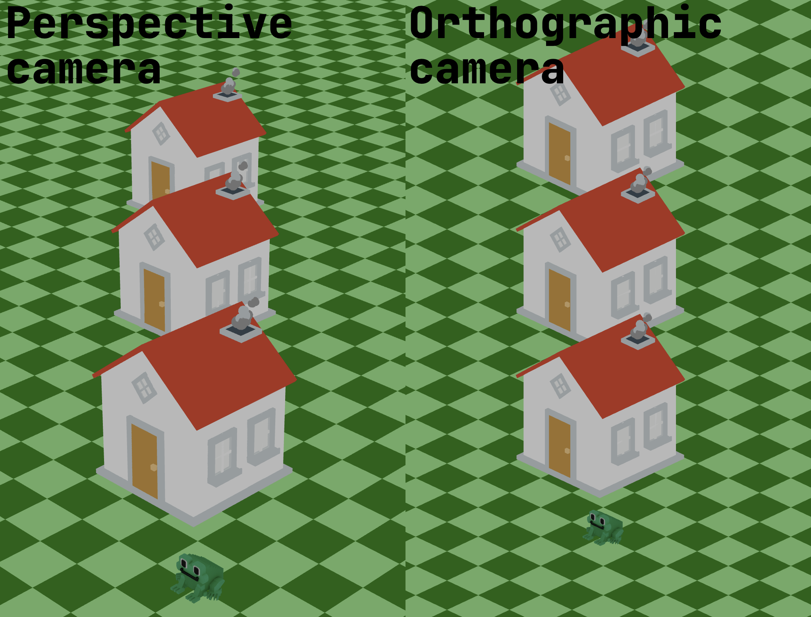

So, we need to take the first major step: create a scene and place the first object that we will be able to see.

To make it easier for you to get started, we have added some technical details to the agent prompt. 

So, what do we need to pay attention to?

### Scene
Nothing special, the Three.js library already has a ready-made constructor for the scene. All other objects will be placed on it.

### Lights
For good visual results, we need to add minimum two light sources to the scene:
- **Ambient light** which fills the stage with light.
- **Directional light** which adds shadows and makes objects truly three-dimensional.
  
Take a look at the effect of these two light sources at this example:

### Player model
Next, let's create our hero. Here, we can slightly influence the structure of our project and 
specify that we want to create a `game/src/components` directory and a `Player` file inside it.
As the image of our hero, we will use the 3D model `tode.glb` already located in the `game/public/models` directory, 
but you can draw or find another model for the main character.

Note that some models may load rotated (for example, lying on their side), so you might need to fix it manually after loading.
For example, `frog.rotation.x = Math.PI / 2` (or another angle/axis). 
You may need to tweak the rotation axis and angle offsets for your specific model until it looks correct or just ask the coding agent to fix it.

### Camera
To be able to see our hero, we need to add a camera to the scene.
There are two types of cameras: **Orthographic camera** and **Perspective camera**.
Perspective camera mimics human vision, making distant objects smaller and lines converge, 
while orthographic camera shows objects at true size regardless of distance, keeping parallel lines parallel.

To make our game feel more realistic, we will use a perspective camera. 
We already suggesting some parameters for it to you in the agent prompt, 
but feel free to change them and change the camera position.  

### Rendering
And the last step is to visualize our scene. This is where the renderer comes to our aid.
Renderer takes the scene and the camera and converts all 3D data into pixels that appear in the browser window.

### Putting it all together
Use specification from the `spec.md` file to create a scene with a player model and a camera.
You can use it as is, or you can tune some parameters to make it look better for you.

At this stage, you should see our hero in the browser on a white background in the center of the window:

### Where to get models?
In this course, we have prepared several models for you to use, but don't limit yourself to just these.
- You can always find open models on resources such as [poly.pizza](https://poly.pizza/), [Sketchfab](https://sketchfab.com/), and others.
- You can generate then with AI models like [Nano Banana](https://openrouter.ai/google/gemini-3-pro-image-preview).
- Or you can create your own models using 3D modeling software such as [Blender](https://www.blender.org/).
